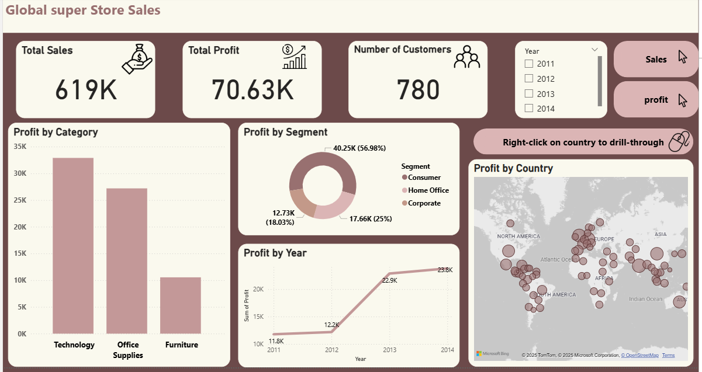
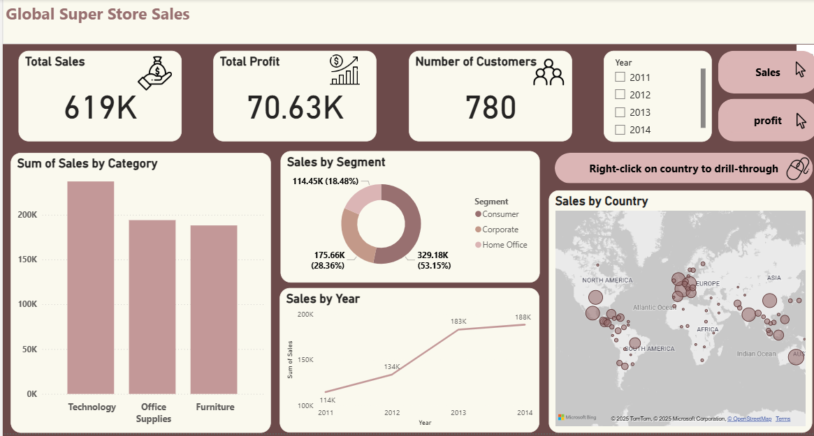
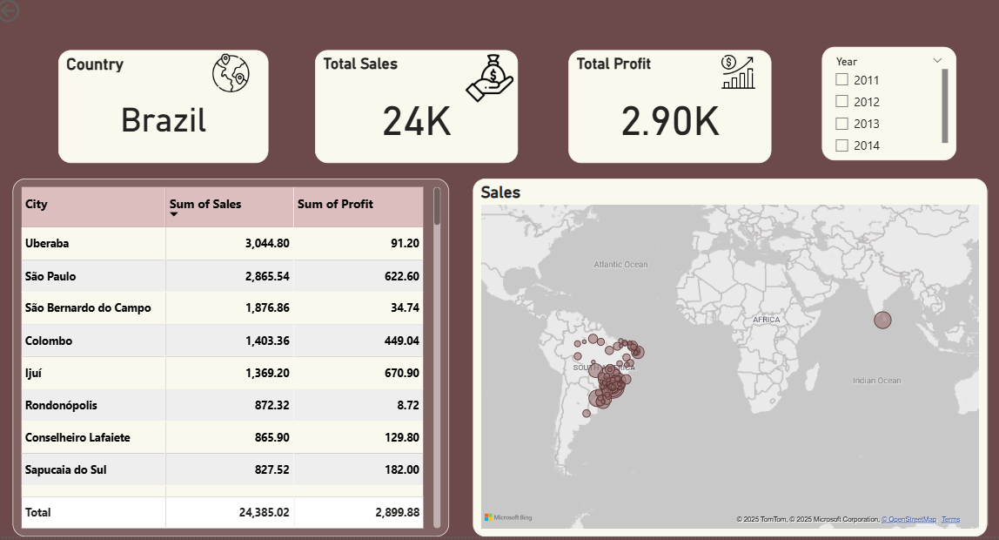

#  Power BI Sales Dashboard

This project contains an interactive dashboard for analyzing sales data using *Power BI*.

---
## Overview

This Power BI dashboard provides a comprehensive analysis of the Global Superstore dataset.
It visualizes key performance metrics such as total sales, total profit, and customer count, helping users understand business performance across categories, years, and regions.

---

##  Key Features

Total Sales & Profit KPIs: Track overall performance with dynamic metrics.

Profit by Category & Segment: Identify the most profitable product categories and customer segments.

Yearly Trends: Analyze how profit changes over the years.

Geographic Visualization: Interactive map showing profit by country.

Drill-Through Functionality: Click on a country to view detailed sales and profit insights for that region.

Filters: Year slicers for customized analysis (2011–2014).

---

##   Tools Used

Power BI

Global Superstore Dataset

Map Visualization

Data Modeling & DAX

---

##  Dashboard Preview

### Sales Overview

### Profit Analysis

### Country Details

---

